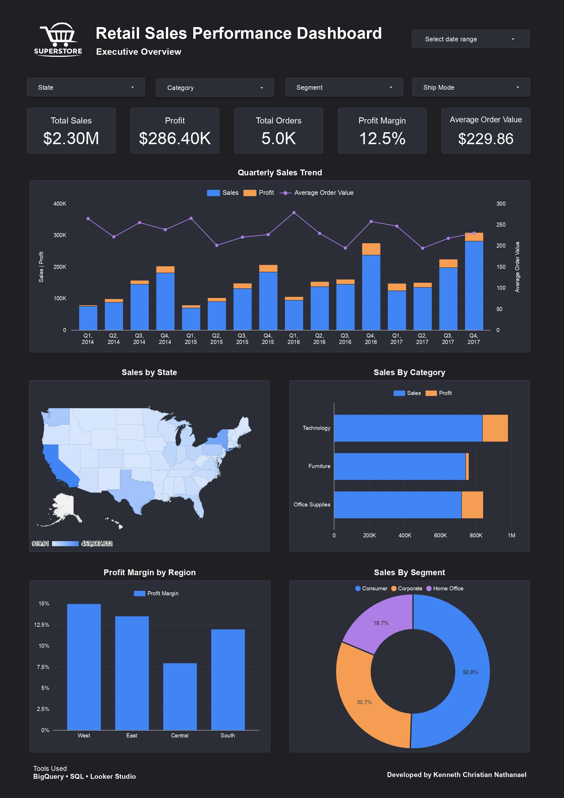
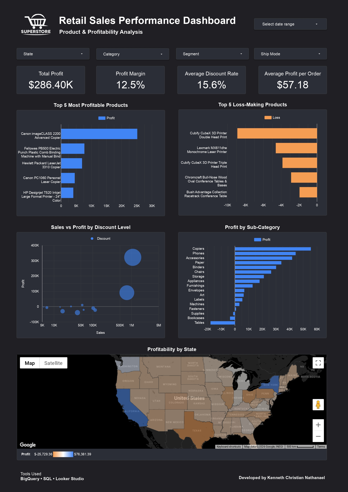
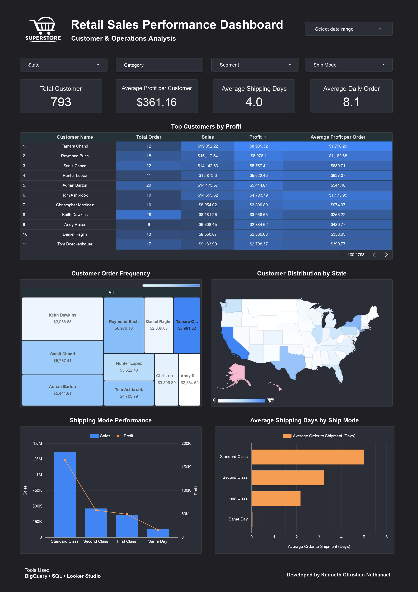

# Retail Sales Performance Dashboard

An end-to-end retail sales analysis project using the **Superstore dataset**, built with **BigQuery SQL** and visualized through **Looker Studio**.

This project transforms raw transactional retail data into actionable business insights by analyzing sales performance, profitability, customer behavior, and shipping operations through SQL analysis and interactive dashboard visualization.

---

# Dashboard Preview

## Executive Overview



---

## Product & Profitability Analysis



---

## Customer & Operations Analysis



---

# Project Overview

Retail businesses generate large volumes of transactions across multiple products, customer segments, and geographic regions.

To support business decisions effectively, companies need clear visibility into:

- Revenue performance
- Profitability trends
- Product contribution
- Customer behavior
- Operational efficiency

This project analyzes the Superstore dataset to answer key business questions and presents the results through an interactive dashboard built for business stakeholders.

---

# Business Objectives

The main objectives of this project are:

### Sales Performance

- Analyze overall sales trends over time
- Identify top-performing regions and states
- Evaluate category and sub-category contribution

### Profitability Analysis

- Identify profitable and loss-making products
- Measure profit margin across categories and regions
- Evaluate discount impact on profitability

### Customer Analysis

- Analyze customer contribution
- Identify top customers by profit
- Evaluate segment distribution

### Operational Analysis

- Measure shipping performance
- Analyze average shipping days
- Compare shipping mode effectiveness

---

# Tools & Technologies

| Tool | Purpose |
|---|---|
| BigQuery | Data storage and SQL execution |
| SQL | Data cleaning and business analysis |
| Looker Studio | Dashboard visualization |

---

# Dataset Information

Dataset used:

**Superstore Retail Sales Dataset**

### Dataset Summary

| Metric | Value |
|---|---:|
| Total Rows | 9,994 |
| Total Orders | 5,009 |
| Total Customers | 793 |
| Total Sales | $2.30M |
| Total Profit | $286.40K |
| Average Order Value | $229.86 |
| Profit Margin | 12.5% |

---

# Project Workflow

## 1. Data Preparation

Initial validation was performed using SQL:

### Data Quality Checks

- Check null values
- Validate record consistency
- Review dataset structure

### Dataset Overview

- Total rows
- Unique orders
- Unique customers

---

## 2. Sales Analysis

Analysis performed:

- Annual sales trend
- Monthly sales trend
- Sales by region
- Sales by state
- Sales by city
- Sales by category
- Sales by sub-category
- Sales by product

Purpose:

- Identify revenue drivers
- Compare geographic performance
- Understand category contribution

---

## 3. Profitability Analysis

Analysis performed:

- Top profitable products
- Top loss-making products
- Profitability by state
- Discount analysis
- Profit by category
- Profit by sub-category

Purpose:

- Identify high-margin opportunities
- Detect low-performing products
- Measure pricing impact

---

## 4. Customer Analysis

Analysis performed:

- Customer contribution
- Segment analysis
- Top customers by profit
- Customer order frequency

Purpose:

- Identify valuable customers
- Understand customer behavior

---

## 5. Operations Analysis

Analysis performed:

- Average shipping days
- Shipping mode performance
- Average order value

Purpose:

- Evaluate delivery efficiency
- Compare operational performance

---

# SQL Analysis

All SQL queries used in this project are included in:

```txt
sql/queries.zip
```

The query archive covers:

### Data Quality

- Check null values
- Dataset overview

### Sales Performance

- Annual sales
- Monthly sales
- Sales by region
- Sales by state
- Sales by city
- Sales by category
- Sales by sub-category
- Sales by product

### Customer Analysis

- Customer analysis
- Segment analysis

### Profitability Analysis

- Top profitable products
- Top loss-making products
- Discount analysis
- Profitability by state

### Operations Analysis

- Average shipping days
- Shipping mode performance
- Average order value

---

# Key Insights

## 1. West region delivered the strongest performance

West generated the highest sales and strongest profit margin.

---

## 2. Technology was the most profitable category

Technology outperformed Furniture and Office Supplies.

---

## 3. Furniture showed weaker profitability

Several furniture products generated low or negative margins.

---

## 4. Losses were concentrated in specific products

Products such as tables and bookcases consistently generated losses.

---

## 5. Discounts reduced profitability

Higher discount levels were associated with lower margins and increased losses.

---

## 6. Consumer segment contributed the highest sales share

Consumer represented the largest portion of total revenue.

---

## 7. A small number of customers generated significant profit

Top customers contributed disproportionately to profitability.

---

## 8. Standard Class handled the largest order volume

Shipping performance remained relatively efficient.

---

# Business Recommendations

Based on the analysis:

### Pricing Strategy

- Review discount policies
- Reduce excessive discounting on low-margin products

### Product Strategy

- Prioritize profitable product categories
- Evaluate loss-making inventory

### Regional Strategy

- Improve underperforming states
- Replicate successful regional strategies

### Customer Strategy

- Retain high-value customers
- Strengthen customer engagement

### Operations Strategy

- Optimize shipping performance
- Improve slower delivery methods

---

# Repository Structure

```bash
superstore-retail-sales-dashboard/
│
├── data/
│   └── Sales Data - DATA.csv
│
├── sql/
│   └── queries.zip
│
├── dashboard/
│   └── Retail_Sales_Performance_Dashboard.pdf
│
├── images/
│   ├── Retail_Sales_Performance_Dashboard_page-0001.jpg
│   ├── Retail_Sales_Performance_Dashboard_page-0002.jpg
│   └── Retail_Sales_Performance_Dashboard_page-0003.jpg
│
└── README.md
```

---

# Skills Demonstrated

This project demonstrates:

- SQL querying
- Data cleaning
- Exploratory data analysis
- Business analysis
- Dashboard design
- Data storytelling
- KPI reporting
- Looker Studio visualization

---

# Author

## Kenneth Christian Nathanael

**BigQuery • SQL • Looker Studio**

Portfolio project focused on retail sales analytics and business intelligence.
